# Object Detection in an Urban Environment

## Data

For this project, we will be using data from the [Waymo Open dataset](https://waymo.com/open/).

[OPTIONAL] - The files can be downloaded directly from the website as tar files or from the [Google Cloud Bucket](https://console.cloud.google.com/storage/browser/waymo_open_dataset_v_1_2_0_individual_files/) as individual tf records. We have already provided the data required to finish this project in the workspace, so you don't need to download it separately.

## Structure

### Data

The data you will use for training, validation and testing is organized as follow:
```
/home/workspace/data/waymo
    - training_and_validation - contains 97 files to train and validate your models
    - train: contain the train data (empty to start)
    - val: contain the val data (empty to start)
    - test - contains 3 files to test your model and create inference videos
```

The `training_and_validation` folder contains file that have been downsampled: we have selected one every 10 frames from 10 fps videos. The `testing` folder contains frames from the 10 fps video without downsampling.

You will split this `training_and_validation` data into `train`, and `val` sets by completing and executing the `create_splits.py` file.

### Experiments
The experiments folder will be organized as follow:
```
experiments/
    - pretrained_model/
    - exporter_main_v2.py - to create an inference model
    - model_main_tf2.py - to launch training
    - reference/ - reference training with the unchanged config file
    - experiment0/ - create a new folder for each experiment you run
    - experiment1/ - create a new folder for each experiment you run
    - experiment2/ - create a new folder for each experiment you run
    - label_map.pbtxt
    ...
```

## Prerequisites

### Local Setup

For local setup if you have your own Nvidia GPU, you can use the provided Dockerfile and requirements in the [build directory](./build).

Follow [the README therein](./build/README.md) to create a docker container and install all prerequisites.

### Download and process the data

**Note:** ”If you are using the classroom workspace, we have already completed the steps in the section for you. You can find the downloaded and processed files within the `/home/workspace/data/preprocessed_data/` directory. Check this out then proceed to the **Exploratory Data Analysis** part.

The first goal of this project is to download the data from the Waymo's Google Cloud bucket to your local machine. For this project, we only need a subset of the data provided (for example, we do not need to use the Lidar data). Therefore, we are going to download and trim immediately each file. In `download_process.py`, you can view the `create_tf_example` function, which will perform this processing. This function takes the components of a Waymo Tf record and saves them in the Tf Object Detection api format. An example of such function is described [here](https://tensorflow-object-detection-api-tutorial.readthedocs.io/en/latest/training.html#create-tensorflow-records). We are already providing the `label_map.pbtxt` file.

You can run the script using the following command:
```
python download_process.py --data_dir {processed_file_location} --size {number of files you want to download}
```

You are downloading 100 files (unless you changed the `size` parameter) so be patient! Once the script is done, you can look inside your `data_dir` folder to see if the files have been downloaded and processed correctly.

### Classroom Workspace

In the classroom workspace, every library and package should already be installed in your environment. You will NOT need to make use of `gcloud` to download the images.

## Instructions

### Exploratory Data Analysis

You should use the data already present in `/home/workspace/data/waymo` directory to explore the dataset! This is the most important task of any machine learning project. To do so, open the `Exploratory Data Analysis` notebook. In this notebook, your first task will be to implement a `display_instances` function to display images and annotations using `matplotlib`. This should be very similar to the function you created during the course. Once you are done, feel free to spend more time exploring the data and report your findings. Report anything relevant about the dataset in the writeup.

Keep in mind that you should refer to this analysis to create the different spits (training, testing and validation).


### Create the training - validation splits
In the class, we talked about cross-validation and the importance of creating meaningful training and validation splits. For this project, you will have to create your own training and validation sets using the files located in `/home/workspace/data/waymo`. The `split` function in the `create_splits.py` file does the following:
* create three subfolders: `/home/workspace/data/train/`, `/home/workspace/data/val/`, and `/home/workspace/data/test/`
* split the tf records files between these three folders by symbolically linking the files from `/home/workspace/data/waymo/` to `/home/workspace/data/train/`, `/home/workspace/data/val/`, and `/home/workspace/data/test/`

Use the following command to run the script once your function is implemented:
```
python create_splits.py --data-dir /home/workspace/data
```

### Edit the config file

Now you are ready for training. As we explain during the course, the Tf Object Detection API relies on **config files**. The config that we will use for this project is `pipeline.config`, which is the config for a SSD Resnet 50 640x640 model. You can learn more about the Single Shot Detector [here](https://arxiv.org/pdf/1512.02325.pdf).

First, let's download the [pretrained model](http://download.tensorflow.org/models/object_detection/tf2/20200711/ssd_resnet50_v1_fpn_640x640_coco17_tpu-8.tar.gz) and move it to `/home/workspace/experiments/pretrained_model/`.

We need to edit the config files to change the location of the training and validation files, as well as the location of the label_map file, pretrained weights. We also need to adjust the batch size. To do so, run the following:
```
python edit_config.py --train_dir /home/workspace/data/train/ --eval_dir /home/workspace/data/val/ --batch_size 2 --checkpoint /home/workspace/experiments/pretrained_model/ssd_resnet50_v1_fpn_640x640_coco17_tpu-8/checkpoint/ckpt-0 --label_map /home/workspace/experiments/label_map.pbtxt
```
A new config file has been created, `pipeline_new.config`.

### Training

You will now launch your very first experiment with the Tensorflow object detection API. Move the `pipeline_new.config` to the `/home/workspace/experiments/reference` folder. Now launch the training process:
* a training process:
```
python experiments/model_main_tf2.py --model_dir=experiments/reference/ --pipeline_config_path=experiments/reference/pipeline_new.config
```
Once the training is finished, launch the evaluation process:
* an evaluation process:
```
python experiments/model_main_tf2.py --model_dir=experiments/reference/ --pipeline_config_path=experiments/reference/pipeline_new.config --checkpoint_dir=experiments/reference/
```

**Note**: Both processes will display some Tensorflow warnings, which can be ignored. You may have to kill the evaluation script manually using
`CTRL+C`.

To monitor the training, you can launch a tensorboard instance by running `python -m tensorboard.main --logdir experiments/reference/`. You will report your findings in the writeup.

### Improve the performances

Most likely, this initial experiment did not yield optimal results. However, you can make multiple changes to the config file to improve this model. One obvious change consists in improving the data augmentation strategy. The [`preprocessor.proto`](https://github.com/tensorflow/models/blob/master/research/object_detection/protos/preprocessor.proto) file contains the different data augmentation method available in the Tf Object Detection API. To help you visualize these augmentations, we are providing a notebook: `Explore augmentations.ipynb`. Using this notebook, try different data augmentation combinations and select the one you think is optimal for our dataset. Justify your choices in the writeup.

Keep in mind that the following are also available:
* experiment with the optimizer: type of optimizer, learning rate, scheduler etc
* experiment with the architecture. The Tf Object Detection API [model zoo](https://github.com/tensorflow/models/blob/master/research/object_detection/g3doc/tf2_detection_zoo.md) offers many architectures. Keep in mind that the `pipeline.config` file is unique for each architecture and you will have to edit it.

**Important:** If you are working on the workspace, your storage is limited. You may to delete the checkpoints files after each experiment. You should however keep the `tf.events` files located in the `train` and `eval` folder of your experiments. You can also keep the `saved_model` folder to create your videos.


### Creating an animation
#### Export the trained model
Modify the arguments of the following function to adjust it to your models:

```
python experiments/exporter_main_v2.py --input_type image_tensor --pipeline_config_path experiments/reference/pipeline_new.config --trained_checkpoint_dir experiments/reference/ --output_directory experiments/reference/exported/
```

This should create a new folder `experiments/reference/exported/saved_model`. You can read more about the Tensorflow SavedModel format [here](https://www.tensorflow.org/guide/saved_model).

Finally, you can create a video of your model's inferences for any tf record file. To do so, run the following command (modify it to your files):
```
python inference_video.py --labelmap_path label_map.pbtxt --model_path experiments/reference/exported/saved_model --tf_record_path /data/waymo/testing/segment-12200383401366682847_2552_140_2572_140_with_camera_labels.tfrecord --config_path experiments/reference/pipeline_new.config --output_path animation.gif
```

## Submission

### Project overview
This section should contain a brief description of the project and what we are trying to achieve. Why is object detection such an important component of self driving car systems?
This project introduces how to object detection pipeline with Tensorflow framework. It contents three major parts:
- EDA (Exploratory Data Analysis ), aims to understand the data, for instance, data type, data distribution, data preprocessing, data visualization, data correlation, etc.
- Model Training, load the object detection model to train with the labeled image data
- Evaluation of the model performance with Tensorboard
- Model fine tuning via optimizer, hyperparameters, data augmentation, etc.

### Set up
This section should contain a brief description of the steps to follow to run the code for this repository.
#### Udacity Workspace Setup
-- start the virtual environment
``` 
source .student_bashrc
```
-- training phase

```
python experiments/model_main_tf2.py --model_dir=experiments/reference/ --pipeline_config_path=experiments/reference/pipeline_new.config
```
-- evaluation phase
```
python experiments/model_main_tf2.py --model_dir=experiments/reference/ --pipeline_config_path=experiments/reference/pipeline_new.config --checkpoint_dir=experiments/reference/
```
### Local Setup

- Requirements

    -   NVIDIA GPU with the latest driver installed
    - docker / nvidia-docker

This build has been tested with Nvidia Drivers 460.91.03 and CUDA 11.2 on a Ubutun 20.04 machine.
Please update the base image if you plan on using older versions of CUDA.

Build the image with:
```
docker build -t project-dev -f Dockerfile .
```

Create a container with:
```
docker run --gpus all -v <PATH TO LOCAL PROJECT FOLDER>:/app/project/ --network=host -ti project-dev bash
```
and any other flag you find useful to your system (eg, `--shm-size`).

Set up

Once in container, you will need to auth using:
```
gcloud auth login
```

### Dataset
#### Dataset analysis
This section should contain a quantitative and qualitative description of the dataset. It should include images, charts and other visualizations.
For instance, the following two training images with the corresponding bonding boxes.
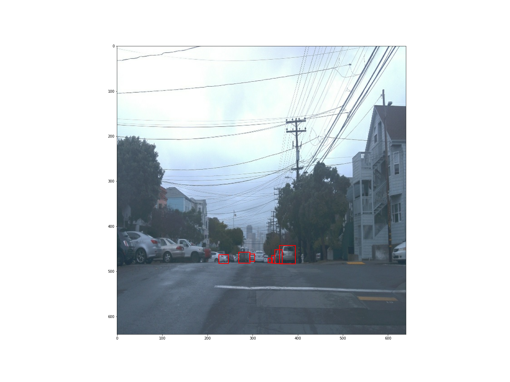
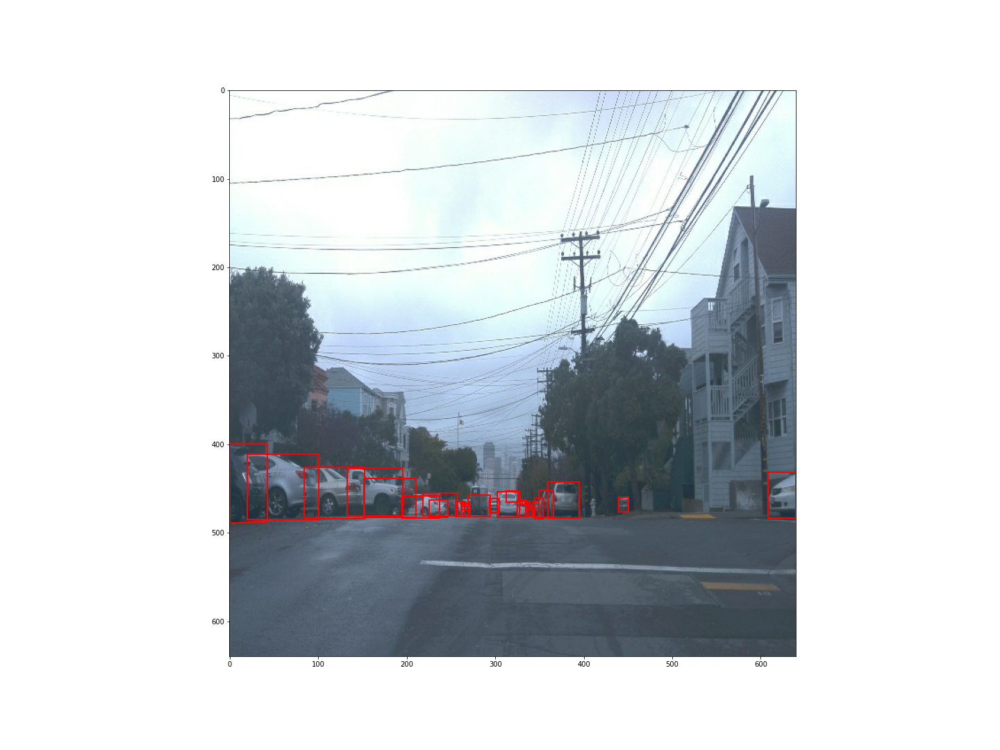

In addition, we analyzed the 10000 training images to understand more deep of the data. We found the major objects per frame is car. The rare occurred object is cyclist. This result is matched with normal traffic scenarios.

- total images:  10000
- car per image:  17.2494
- pedestrain per image:  4.8304
- cyclist per image:  0.1221

The detailed statics of the object number per frame is illustrated as follows:

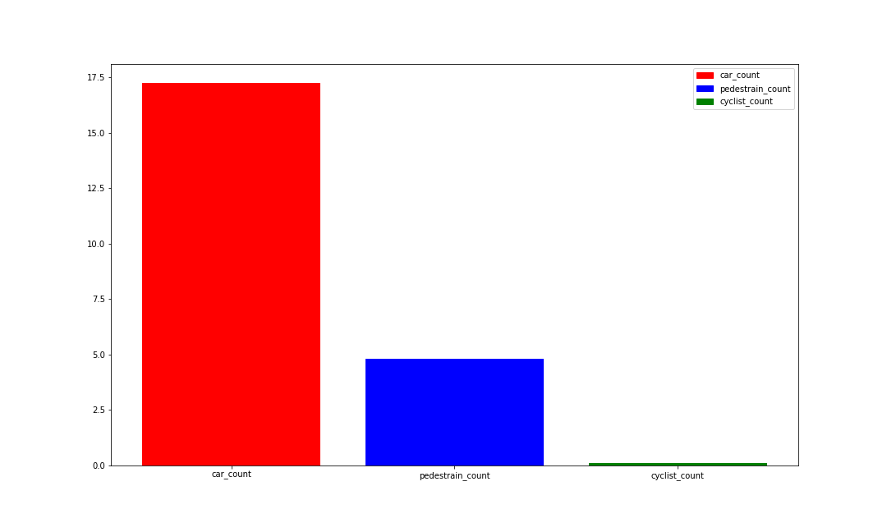

Besides, we noticed the distribution of the car objects per image is more homogeneous in comparison with pedestrian and cyclist.
The following figures present the histogram of the object distribution per image respectively.

Car Object Distribution per Image
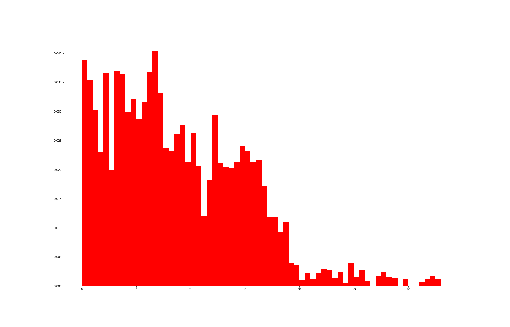

Pedestrain Object Distribution per Image

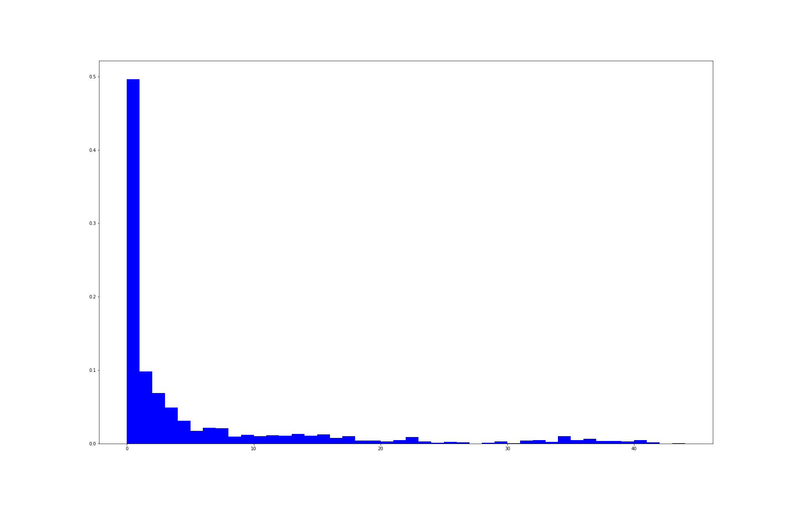

Cyclist Object Distribution per Image

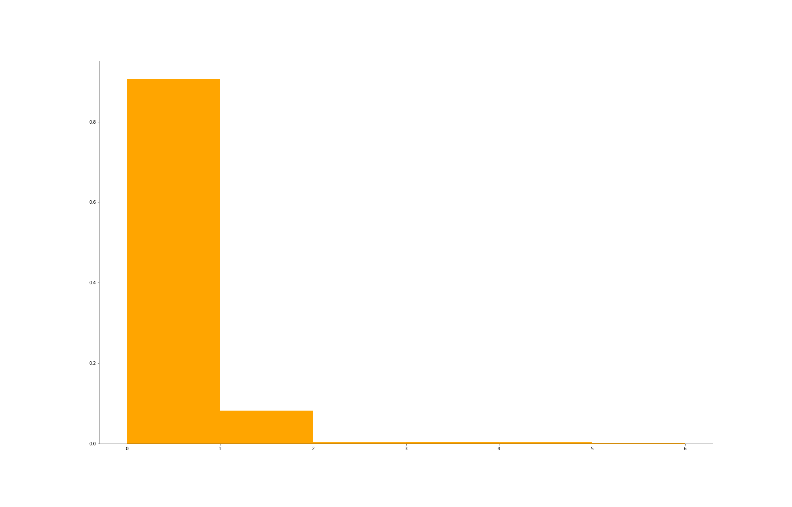

#### Cross validation
This section should detail the cross validation strategy and justify your approach.
Cross validation is a method to improve the generalization of the model performance. In the training phase, we randomly select a small percentage (20%) training data as the validation data to evaluate the performance. The best performed model will be saved to train in next epoch. Iteratively, the model performance is increased.


### Training
#### Reference experiment 1
Experiment 1 is using the default config setting.
Data Augmentation: random_horizontal_flip, random_crop_image

Optimizer: momentum_optimizer

Training phase metrics:
In the total loss we can observe the loss is not decreased at the beginning epochs. At around 700 epochs, the loss is extremely increased. This abnormal behaviour indicates the model is under fitting the data. More training data or data augmentation could improve the performance.
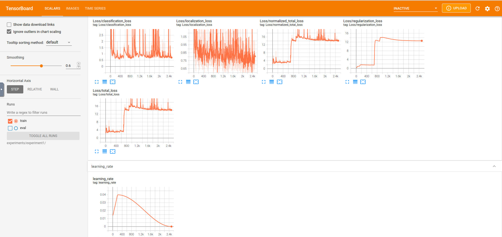

Evaluation of the model:
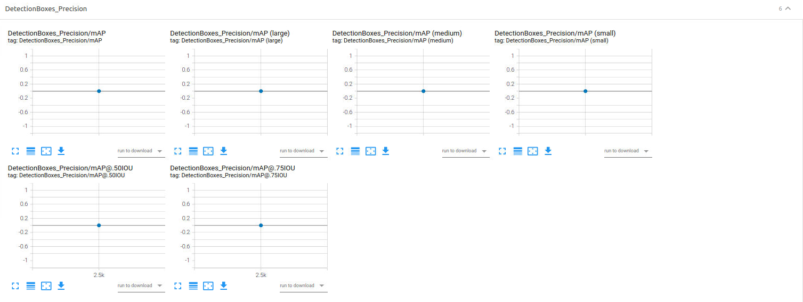
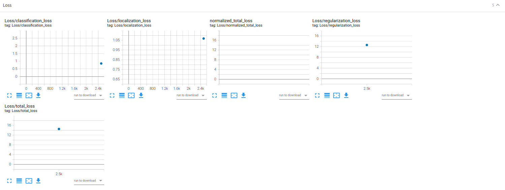

#### Reference experiment 2

Experiment 2 is using the default config setting.
Data Augmentation: random_horizontal_flip, random_crop_image, random_adjust_contrast, random_adjust_saturation, random_adjust_brightness, 

Optimizer: momentum_optimizer

Training phase metrics:
In comparison with experiment 1, we can recognize the total loss has the trends to decrease. In addition, the total loss from experiment 14 is decreased to 4. The improvement is magnificent.
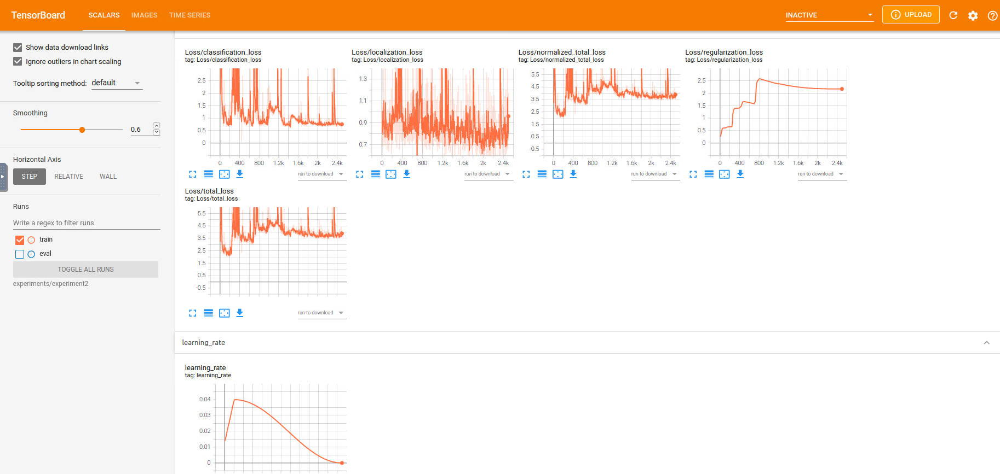

Evaluation of the model:
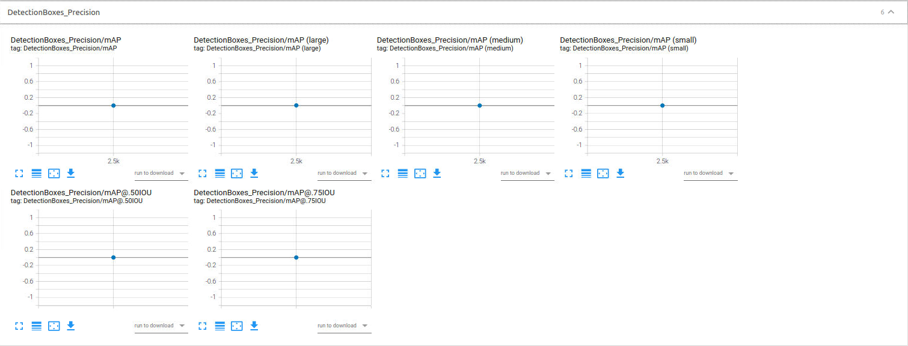
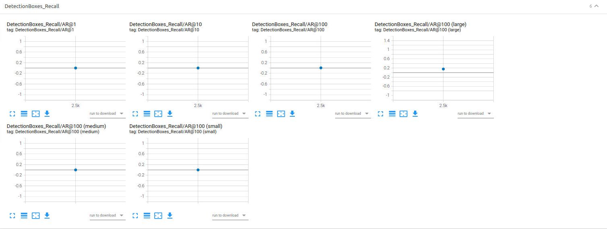
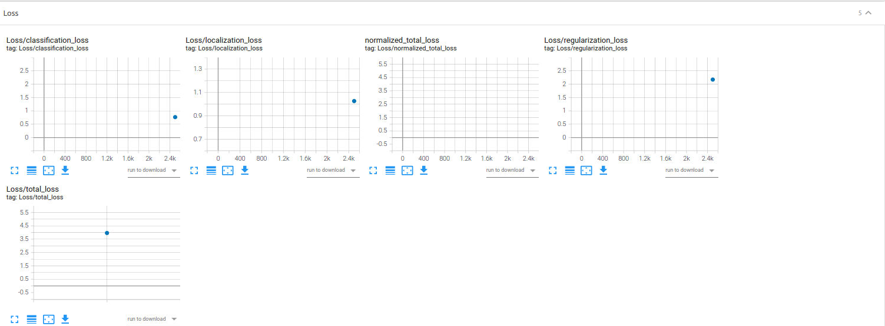

#### Reference experiment 3


Experiment 3 is using the default config setting.
Data Augmentation: random_horizontal_flip, random_crop_image

Optimizer: adam_optimizer

Training phase metrics:
We can notice the adam optimizer has improved the total loss to 1 which is ver promising.
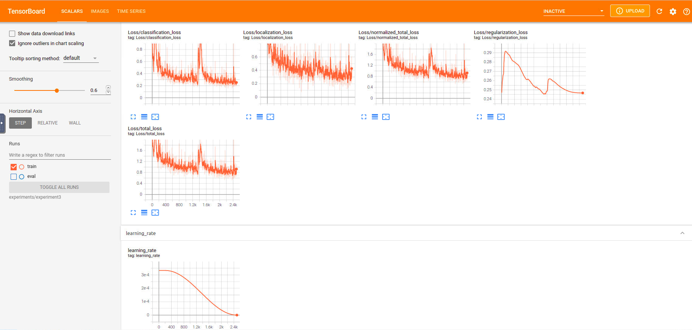

Evaluation of the model:
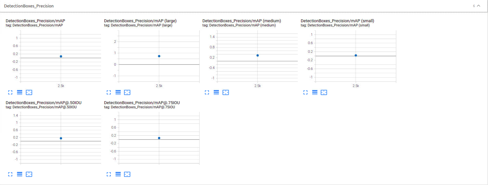
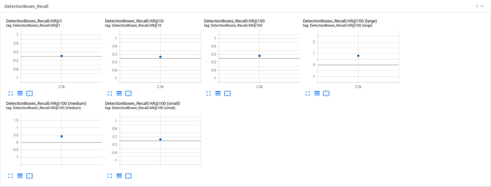
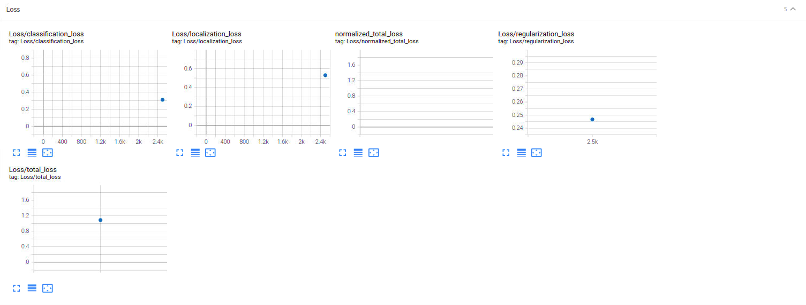


### Reference experiment 4

Experiment 4 is using the default config setting.
Data Augmentation: random_horizontal_flip, random_crop_image, random_adjust_contrast, random_adjust_saturation, random_adjust_brightness, 

Optimizer: adam_optimizer

Training phase metrics:
With combination of data augmentation and Adam optimizer, we have achieved the best loss value to 0.8. 
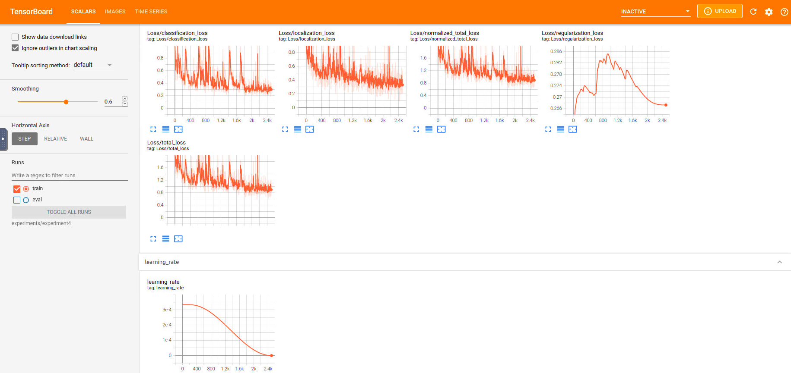

Evaluation of the model:


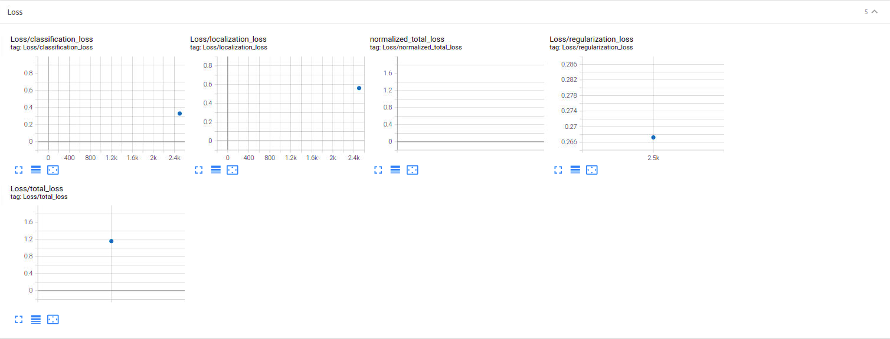


###  Improve on the reference
We have used two strategies to improve the model detection performance as descript in the above four experiments. In summary, we can see data augmentation is very powerful method to improve the generalization ability of the model.
In this model we used the classical data augmentation methods, for instance, image crop, brightness adjustment, etc. Actually, we can also apply the generative model to use the synthetic model. 
- Random brightness adjust

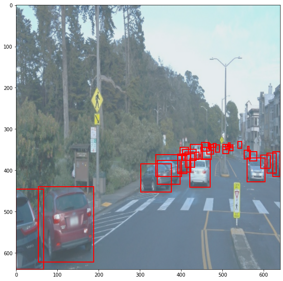

- Random blur
 
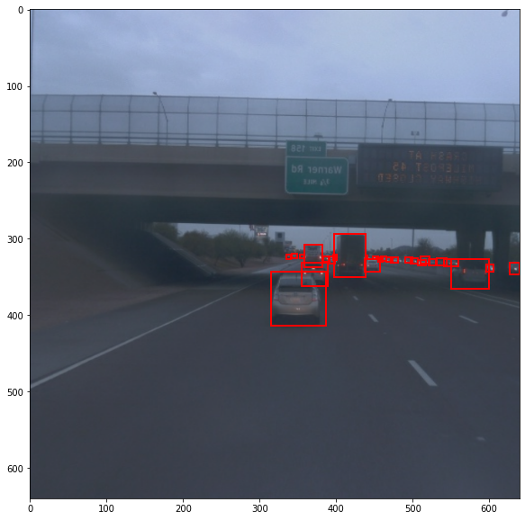

### Animation
The animation is not that long because the workspace popped the error "MovieWriter ffmpeg unavailable; using Pillow instead.
". The [Udacity solution](https://knowledge.udacity.com/questions/898383) seems like need use sudo right to install ffmpeg, which is not possible as student user to install it. 
